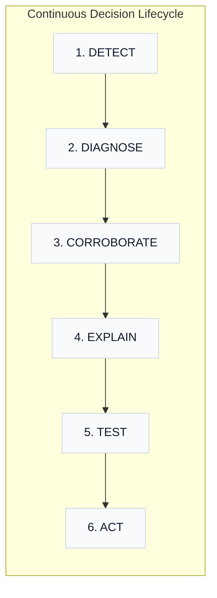
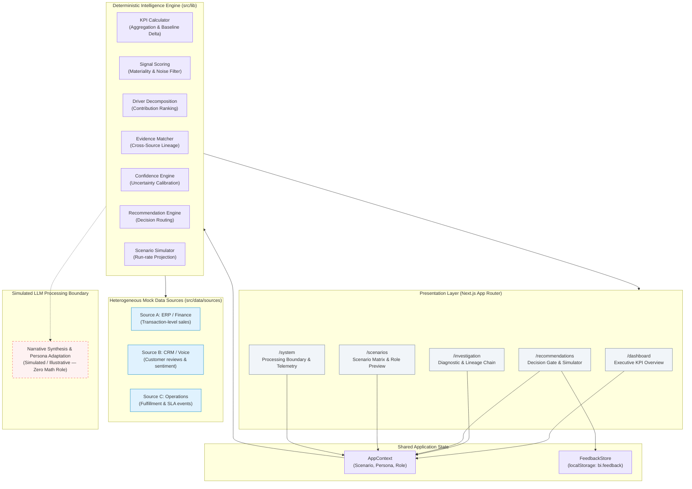

# BusinessIntelligence.ai

> **An evidence-backed KPI intelligence-to-action engine that detects material KPI movements, diagnoses root drivers, corroborates multi-source evidence, communicates calibrated uncertainty, and supports actionable executive business decisions.**

### 🚀 [Live Interactive Demo](https://business-intelligence-ai-tau.vercel.app/) &nbsp;|&nbsp; 📂 [GitHub Repository](https://github.com/Marcus-Aurelius1/business-intelligence-ai)

[](https://business-intelligence-ai-tau.vercel.app/)
[](https://nextjs.org/)
[](https://react.dev/)
[](https://www.typescriptlang.org/)
[](https://tailwindcss.com/)
[](LICENSE)

---

## 1. Overview & Problem Space

Enterprise executives and operators face a persistent **Decision Gap**:
- **Standard BI Dashboards** show *what* happened (e.g., "Revenue is down 8%"), but require hours of manual SQL slice-and-dicing to isolate the underlying cause.
- **Unconstrained AI/LLM Dashboards** generate narrative summaries that frequently hallucinate quantitative metrics, conflate correlation with causation, and lack verifiable data lineage.

**BusinessIntelligence.ai** solves this gap by decoupling **deterministic quantitative computation** from **executive narrative synthesis**:
1. **Detects** statistically material deviations across semantic KPI contracts.
2. **Decomposes** movements into weighted mathematical driver contributions.
3. **Corroborates** structured transaction trends with unstructured customer sentiment and operational incident logs.
4. **Calibrates Uncertainty** to abstain from false recommendations when evidence is contradictory or historical baseline data is sparse.
5. **Simulates Interventions** and routes decisions through a human-controlled decision gate.

---

## 2. Why BusinessIntelligence.ai? (The Decision Gap)

```
┌───────────────────────────────┐     ┌───────────────────────────────┐     ┌───────────────────────────────┐
│        1. WHAT CHANGED?       │     │     2. WHY DID IT CHANGE?     │     │   3. WHAT DO WE DO NEXT?      │
│  Deterministic metric delta   │ ──► │  Driver attribution & multi-  │ ──► │  Simulated interventions with │
│  against semantic baselines   │     │  source evidence matching     │     │  calibrated confidence gating │
└───────────────────────────────┘     └───────────────────────────────┘     └───────────────────────────────┘
```

| Question | Legacy BI Dashboards | Generic GenAI Chatbots | **BusinessIntelligence.ai** |
|---|---|---|---|
| **What changed?** | Static charts & red/green KPI tiles | Unverified text summaries | **Deterministic calculation against contract thresholds** |
| **Why did it change?** | Manual ad-hoc querying across silos | Plausible-sounding narrative guesses | **Mathematical driver decomposition & multi-source evidence lineage** |
| **How certain are we?** | Binary alerts without uncertainty context | Overconfident assertions without scoring | **Calibrated confidence scoring with positive & negative risk factors** |
| **What should we do?** | Left entirely to human intuition | Generic recommendations without testing | **Actionable lever simulation, impact projection & human decision gate** |

---

## 3. Product Workflow



1. **Detect**: Ingests heterogeneous transactional data, recalculates semantic KPIs, checks threshold triggers, and computes signal materiality scores.
2. **Diagnose**: Performs multi-dimensional variance analysis to rank top contributing drivers (e.g., volume drop vs. price variance vs. fulfillment lag).
3. **Corroborate**: Matches qualitative customer feedback and operational logs to quantitative drivers; surfaces supporting evidence and counter-signals.
4. **Explain**: Generates persona-tailored executive narratives (Business Head, Finance Controller, Business Analyst) while preserving identical underlying math.
5. **Test**: Allows executives to test intervention assumptions in real time and project impact on run-rate recovery.
6. **Act**: Evaluates confidence thresholds to route actions into `RECOMMEND`, `REVIEW` (Abstain/Clarify), or `ESCALATE` with a human-in-the-loop decision gate.

---

## 4. Key Implemented Capabilities

- **Semantic KPI Contracts**: Explicit data contracts declaring formula, dimensions, lineage, signal thresholds, and role-based permissions (`src/data/kpis/contracts.ts`).
- **Deterministic Math Engine**: SQL-style in-memory aggregations and variance calculations (`src/lib/analytics/kpi-calculator.ts`).
- **Signal & Materiality Scoring**: Dual-factor significance algorithm combining percentage deviation against baseline with noise filtering (`src/lib/signals/scoring.ts`).
- **Weighted Driver Decomposition**: Multi-dimensional contribution ranking with method attribution (`src/lib/drivers/decomposition.ts`).
- **Multi-Source Evidence Corroboration**: Unified matching across ERP, CRM, and Operations sources with lineage paths and counter-signal detection (`src/lib/evidence/matcher.ts`).
- **Calibrated Uncertainty & Abstention**: Composite scoring (0–100%) incorporating corroboration strength, sample size, and data freshness; automatically **abstains** (`REVIEW`) when confidence is low (`src/lib/confidence/calculation.ts`).
- **Sparse-History / Cold-Start Handling**: Distinct monitoring posture for newly introduced KPIs with insufficient historical baselines.
- **Persona-Adapted Narratives**: Dynamic executive viewpoints focused on strategic, financial, or operational concerns without altering quantitative figures.
- **Interactive Scenario Impact Testing**: Parameterized simulation tool calculating projected run-rate recovery under adjustable operational assumptions (`src/lib/analytics/scenario-test.ts`).
- **Role-Based Entitlement & Masking**: Dynamic KPI visibility filtering and sensitive supplier data masking (`████████`) (`src/lib/permissions/entitlements.ts`).
- **Closed-Loop Feedback Store**: In-browser local storage persistence for executive feedback on recommendations (`src/lib/feedback/store.ts`).
- **Runtime Telemetry & Audit**: Real-time tracking of pipeline latency, source freshness, processing method counts, and illustrative token usage (`src/components/telemetry/TelemetryPanel.tsx`).

---

## 5. System Architecture

The application is structured as a client-side decision intelligence system built on Next.js 16 (App Router). All quantitative calculations execute deterministically in memory.



---

## 6. Data Sources

The intelligence engine ingests three distinct data feeds located in `src/data/sources/`:

| Source | File | Grain | Refresh | Key Fields | Pipeline Role |
|---|---|---|---|---|---|
| **ERP / Finance** | `sales-transactions.ts` | `transaction / product / region / channel / day` | 15 min | `units`, `price`, `revenue`, `grossMargin`, `baselineRevenue` | Primary quantitative truth for Revenue, Gross Margin, Units, and ASP calculations. |
| **CRM / Customer Voice** | `customer-feedback.ts` | `feedback / customer / region / day` | 45 min | `issueType`, `sentiment`, `deliveryIssue`, `text` | Unstructured evidence corroboration and customer sentiment shift analysis. |
| **Operations / Fulfillment** | `operations-events.ts` | `event / facility / region / day` | 30 min | `fulfillmentCapacity`, `inventoryAvailability`, `deliverySLA`, `incidentType` | Operational root cause corroboration, warehouse constraints, and delivery SLA tracking. |

---

## 7. KPI Semantic Contracts

Every monitored KPI is governed by an explicit semantic contract in `src/data/kpis/contracts.ts`. Contracts ensure mathematical definitions, dimensionality, lineage, and access boundaries remain invariant across views:

```typescript
// Real excerpt from src/data/kpis/contracts.ts
export const kpiContracts: Record<string, KPI> = {
  revenue: {
    id: 'revenue',
    name: 'Revenue',
    definition: 'Sum of net transaction value across all products and regions',
    calculation: 'Σ(units × net selling price)',
    dimensions: ['Region', 'Product', 'Channel', 'Time'],
    drivers: ['Volume', 'Price', 'Mix', 'Marketing', 'Fulfillment'],
    materialityThreshold: 5, // ≥5% deviation triggers materiality alert
    signalThreshold: 70,      // Score >70 indicates statistically significant movement
    lineage: 'ERP → sales_transactions → revenue aggregation',
    access: ['business_head', 'finance_controller', 'business_analyst'],
  },
  gross_margin: {
    id: 'gross_margin',
    name: 'Gross Margin',
    definition: 'Total gross profit as percentage of revenue',
    calculation: 'Σ(revenue × margin_rate) / Σ(revenue) × 100',
    dimensions: ['Region', 'Product', 'Channel', 'Time'],
    drivers: ['Product Mix', 'Pricing', 'Promotional Discount', 'Supplier Cost'],
    materialityThreshold: 3,
    signalThreshold: 65,
    lineage: 'ERP → sales_transactions → margin calculation',
    access: ['business_head', 'finance_controller'],
  },
  // Additional contracts: units_sold, average_selling_price, fulfillment_sla
};
```

---

## 8. Deterministic Intelligence Pipeline

The engine executes an end-to-end analytical pipeline on every state transition:

```
[Raw Ingestion] ──► [KPI Aggregation] ──► [Signal Scoring] ──► [Driver Ranking] ──► [Evidence Corroboration] ──► [Confidence Calibration] ──► [Decision Routing]
```

1. **KPI Aggregation (`kpi-calculator.ts`)**: Sums current transaction revenues and computes percentage/absolute deltas against historical baseline transactions:
   $$\Delta\% = \frac{\text{Current Value} - \text{Baseline Value}}{\text{Baseline Value}} \times 100$$
2. **Signal Significance & Materiality (`scoring.ts`)**: Evaluates deviation magnitude against contract thresholds to assign status: `stable`, `investigate`, or `action_required`.
3. **Driver Decomposition (`decomposition.ts`)**: Computes relative variance contribution across dimensions:
   $$\text{Contribution} = \frac{|\Delta \text{Segment}|}{\sum |\Delta \text{Segments}|} \times 100$$
4. **Evidence Matching (`matcher.ts`)**: Retrieves linked structured transactions, operational incidents, and customer reviews. Automatically isolates **counter-signals** (e.g., promotional marketing lifts that offset baseline declines).
5. **Calibrated Confidence Assessment (`calculation.ts`)**: Calculates a bounded score (0–100%) based on multi-source corroboration, evidence consistency, sample volume, and data recency.
6. **Decision Routing (`engine.ts`)**: Evaluates confidence and risk thresholds to assign a governance state:
   - **`RECOMMEND`** (Confidence $\ge 70\%$): Formulates proactive intervention with immediate approval enabled.
   - **`REVIEW`** (Confidence $< 70\%$): Emits an **Abstain** banner, surfaces targeted clarification questions, and gates approval behind an explicit human override.
   - **`ESCALATE`**: Flags high-materiality risk requiring immediate executive steering.

> **Note on Causality**: The engine quantifies historical variance contribution and temporal correlation across data sources. It does not assert unproven causal mechanisms.

---

## 9. Primary Demonstration Scenario

### West Region Revenue Contraction (`primary`)

```
Baseline: ₹42.1M  ──────►  Current: ₹38.7M  ( -8.07% / -₹3.4M contraction )
Signal Score: 92/100 (High Materiality)  |  Calibrated Confidence: 78% (High)  |  Routing: RECOMMEND
```

- **Top Contributing Drivers**:
  1. **Fulfillment & Logistics Bottleneck** (48% contribution, 85% confidence, Method: Variance + SLA Correlation)
  2. **Offline Retail Footfall Softness** (32% contribution, 72% confidence, Method: Channel Mix Analysis)
  3. **Regional Price Competition** (20% contribution, 65% confidence, Method: Competitor Price Indexing)
- **Multi-Source Evidence Chain**:
  - *Operational*: West Distribution Hub operating at 60% capacity due to maintenance and staffing shortages (Delivery SLA dropped to 76%).
  - *Customer Sentiment*: 37 delivery complaints logged in CRM citing multi-day delays.
  - *Counter-Signal*: Online promotional marketing campaign generated +₹400K lift in Electronics, partially masking the underlying offline drop.
- **Recommended Action**: Reallocate 30% of West online order fulfillment to the South Distribution Hub and introduce a temporary 48h SLA subsidy.
- **Projected Impact**: Recover **₹1.8M–₹2.2M monthly revenue run-rate** within 14 days.

---

## 10. Personas & Multi-Scenario Matrix

### Executive Personas

The application dynamically tailors executive narratives without altering underlying quantitative truth:

| Persona | Primary Focus | Tailored Narrative Focus |
|---|---|---|
| **Business Head** | Top-line run-rate & operational recovery | Prioritizes customer satisfaction impact, fulfillment bottlenecks, and SLA recovery timelines. |
| **Finance Controller** | Margin preservation & unit economics | Highlights gross margin erosion (29.7% → 28.9%), supplier pricing exposure, and express freight subsidy ROI. |
| **Business Analyst** | Statistical validity & driver contribution | Focuses on multi-source evidence lineage, correlation coefficients, variance breakdown, and data recency. |

### Evaluation Scenarios

| Scenario | Scenario ID | Confidence | Decision Routing | System Posture |
|---|---|---:|---|---|
| **West Revenue Investigation** | `primary` | **78%** | `RECOMMEND` | Strong multi-source corroboration; action recommendations active; approval enabled. |
| **Conflicting Evidence** | `low_confidence` | **34%** | `REVIEW` | **Abstains** from automated recommendation; surfaces specific clarification questions; approval disabled without explicit human override. |
| **New KPI / Sparse History** | `sparse_history` | **15%** | `REVIEW` | **Monitors** cold-start metric; suppresses false driver attribution; displays neutral baseline availability note. |

---

## 11. Trust, Uncertainty & Human-in-the-Loop Control

```
┌──────────────────────────────────────────────────────────────────────────────────┐
│                             HUMAN DECISION GATE                                  │
├──────────────────────────────────────────────────────────────────────────────────┤
│  [ Defer Decision ]        [ Test Assumptions ]        [ Approve Intervention ]  │
│                                                                                  │
│  ⚠ SYSTEM ABSTENTION ACTIVE (Confidence 34% < Threshold 70%)                    │
│  [ ] Override system abstention (Record decision audit log at shown confidence)  │
└──────────────────────────────────────────────────────────────────────────────────┘
```

1. **Explicit Calibrated Confidence**: Every recommendation exposes positive confidence drivers (multi-source corroboration, temporal alignment) alongside negative uncertainty factors (unquantified macro trends, promotional distortion).
2. **Automated Abstention**: When evidence contradicts or data volume is insufficient, the system explicitly abstains from prescriptive recommendations rather than guessing.
3. **Gated Approval with Override Audit**: In abstention states, the **Approve** action is disabled unless the executive checks **Human override**, creating an auditable record of human judgment over automated recommendations.
4. **Role-Based Sensitive Data Masking**: Controlled roles (e.g., Restricted User) observe supplier names and margin terms rendered as `████████` with a visible security badge.
5. **Verifiable Lineage Paths**: Every evidence item presents an end-to-end audit path (e.g., `ERP → sales_transactions → region=West → channel=Offline`).

---

## 12. Deterministic vs. LLM Processing Boundary

A foundational architectural rule in BusinessIntelligence.ai is the strict isolation of quantitative math from natural language synthesis:

```
┌────────────────────────────────────────────────────────────────────────────────┐
│                           DETERMINISTIC COMPUTE (TRUTH)                        │
│   • KPI Aggregations & Formulas          • Driver Contribution Variance Math   │
│   • Threshold & Materiality Scoring      • Calibrated Confidence Scoring (0-100)│
└──────────────────────────────────────┬─────────────────────────────────────────┘
                                       │ Structured Intelligence Payloads
                                       ▼
┌────────────────────────────────────────────────────────────────────────────────┐
│                       LLM / GENERATIVE SYNTHESIS (EXPLAIN)                     │
│   • Executive Narrative Summaries        • Role / Persona Tone Adaptation      │
│   • Action Drafting & Summarization      • Zero Role in Quantitative Math      │
│   (Labelled Simulated / Illustrative in this portfolio build)                 │
└────────────────────────────────────────────────────────────────────────────────┘
```

- **Calculations are Never Delegated to LLMs**: Metrics, confidence percentages, contribution shares, and baselines are computed entirely in TypeScript deterministic modules.
- **Simulated LLM Accounting**: LLM usage (call counts, tokens, estimated costs) is tracked and explicitly marked **Simulated / Illustrative** in the UI to demonstrate telemetry accounting without relying on unconstrained live APIs.

---

## 13. Verifiable Telemetry & Observability

The telemetry subsystem (`src/components/telemetry/TelemetryPanel.tsx`) provides real-time auditability across the decision pipeline:

| Telemetry Dimension | Primary Scenario Value | Method / Label | Description |
|---|---|---|---|
| **Analysis Latency** | `1.80s` | Deterministic | End-to-end execution latency for data ingestion, KPI calc, and driver ranking. |
| **Connected Data Sources** | `3 sources` | Deterministic | Number of active integration contracts (ERP, CRM, Operations). |
| **Data Freshness** | `12m ago` | Deterministic | Timestamp delta of the freshest connected data stream. |
| **Processing Methods** | `D: 4  ·  S: 2  ·  R: 1  ·  LLM: 2` | Deterministic | Audit breakdown of Deterministic, Statistical, Retrieval, and Generative execution steps. |
| **Generative LLM Calls** | `2 calls` | Simulated / Illustrative | Model execution passes for narrative synthesis and persona formatting. |
| **Token Usage** | `1,182 prompt / 423 completion` | Simulated / Illustrative | Token volume consumed by executive explanation layers. |
| **Estimated Inference Cost** | `~$0.0099 USD` | Simulated / Illustrative | Calculated inference cost based on standard token pricing tiers. |

---

## 14. Application Views & Navigation

| View / Route | Route File | Purpose & Key Features |
|---|---|---|
| **Executive Dashboard** (`/dashboard`) | `src/app/dashboard/page.tsx` | Top-level KPI performance grid, metric movement indicators, scenario selector, and telemetry ribbon. Revenue KPI highlighted with primary top-line priority. |
| **Investigation Pipeline** (`/investigation`) | `src/app/investigation/page.tsx` | Diagnostic deep-dive featuring the 6-step **Analysis Chain**, Driver Decomposition bar chart, Evidence Explorer with lineage tags, and sensitive supplier details. |
| **Recommendations & Decision Gate** (`/recommendations`) | `src/app/recommendations/page.tsx` | Prescriptive action cards, expected impact calculations, interactive Scenario Simulation sandbox, Human Decision Gate (Approve/Defer/Override), and feedback widget. |
| **Scenario Matrix** (`/scenarios`) | `src/app/scenarios/page.tsx` | Side-by-side scenario matrix comparing confident, low-confidence (abstain), and cold-start baselines; interactive role entitlement preview with live field masking. |
| **System & Processing Boundary** (`/system`) | `src/app/system/page.tsx` | Architectural audit console displaying connected source freshness contracts, the 4-quadrant processing boundary, and the full telemetry panel. |

---

## 15. Technology Stack

- **Framework**: [Next.js 16.3.3](https://nextjs.org/) (App Router, Turbopack)
- **UI & Runtime**: [React 19.2.8](https://react.dev/), [React DOM 19.2.8](https://react.dev/)
- **Language**: [TypeScript 5.0](https://www.typescriptlang.org/) (Strict Mode)
- **Styling**: Vanilla CSS with custom semantic design tokens (`globals.css`) + [Tailwind CSS v4](https://tailwindcss.com/)
- **State Management**: React Context API (`src/lib/state/app-context.tsx`) + `localStorage` for closed-loop feedback persistence
- **Quality & Linting**: [ESLint 9](https://eslint.org/) with `eslint-config-next`

---

## 16. Project Directory Structure

```
business-intelligence-ai/
├── src/
│   ├── app/                               # Next.js App Router routes
│   │   ├── dashboard/page.tsx             # /dashboard - Executive KPI overview
│   │   ├── investigation/page.tsx         # /investigation - Analysis chain & evidence
│   │   ├── recommendations/page.tsx       # /recommendations - Decision gate & simulator
│   │   ├── scenarios/page.tsx             # /scenarios - Scenario matrix & role preview
│   │   ├── system/page.tsx                # /system - Processing boundary & telemetry
│   │   ├── globals.css                    # Design tokens & craft-floor styles
│   │   └── layout.tsx                     # Root HTML shell & fonts
│   ├── components/                        # Modular UI components
│   │   ├── charts/                        # Driver decomposition & signal meters
│   │   ├── confidence/                    # Calibrated confidence scoring display
│   │   ├── evidence/                      # Evidence explorer with lineage paths
│   │   ├── feedback/                      # Recommendation feedback widget
│   │   ├── kpi/                           # KPI card with delta & baseline rows
│   │   ├── layout/                        # AppLayout shell
│   │   ├── navigation/                    # Top bar & sidebar navigation
│   │   ├── recommendations/               # Recommendation action cards
│   │   └── telemetry/                     # System telemetry & cost panel
│   ├── data/                              # Mock data sources & contracts
│   │   ├── kpis/contracts.ts              # Semantic KPI contracts
│   │   ├── scenarios/                     # Scenario configs & primary demo data
│   │   └── sources/                       # Heterogeneous ERP, CRM, and Ops mock data
│   ├── lib/                               # Deterministic intelligence engine
│   │   ├── analytics/                     # KPI calculators & scenario test simulator
│   │   ├── confidence/                    # Uncertainty & risk factor calibration
│   │   ├── drivers/                       # Multi-dimensional variance decomposition
│   │   ├── evidence/                      # Cross-source evidence matcher
│   │   ├── feedback/                      # LocalStorage feedback store
│   │   ├── permissions/                   # Role-based entitlements & field masking
│   │   ├── recommendations/               # Prescriptive action & routing engine
│   │   ├── signals/                       # Signal significance & noise scoring
│   │   └── state/                         # Global React application state context
│   └── types/                             # TypeScript domain models & interfaces
├── docs/                                  # Requirement traceability & design docs
│   └── ROUND2_REQUIREMENTS_CHECK.md       # Innovation Challenge verification matrix
├── public/                                # Static vector assets & icons
├── package.json                           # Dependencies & run scripts
└── tsconfig.json                          # TypeScript compiler configuration
```

---

## 17. Getting Started

### Prerequisites
- Node.js 18.18+ or 20+
- npm 9+

### Installation & Local Run

```bash
# 1. Clone the repository
git clone https://github.com/Marcus-Aurelius1/business-intelligence-ai.git

# 2. Navigate to project root
cd business-intelligence-ai

# 3. Install dependencies
npm install

# 4. Start the development server
npm run dev
```

Open your browser and navigate to **`http://localhost:3000`** (or the port indicated in your terminal).

---

## 18. Verification & Quality Assurance

The codebase adheres to zero-defect type checking and static build validation:

```bash
# Run TypeScript compilation check
npx tsc --noEmit

# Run production Next.js build
npm run build

# Run ESLint check
npm run lint
```

- **TypeScript**: Passes with 0 errors (`npx tsc --noEmit`).
- **Production Build**: Successfully compiles and prerenders all 7 application routes statically (`npm run build`).
- **Linter**: ESLint 9 configured; non-blocking advisory warnings may appear from environment/skill helper scripts without impacting application runtime.

---

## 19. Software Engineering & Portfolio Highlights

This project demonstrates several critical enterprise software engineering principles:

1. **Separation of Concerns**: Complete isolation between deterministic mathematical truth and generative executive communication.
2. **Calibrated Uncertainty**: Systematic resistance to AI overconfidence through explicit positive/negative uncertainty scoring and automated abstention.
3. **Traceable Lineage Architecture**: Full visibility from executive actions down to individual transaction and log records.
4. **Stateful Decision Workflow**: Interactive parameter simulation and closed-loop decision recording without server dependency.
5. **High-Density Enterprise UX**: Cohesive design system built on vanilla CSS semantic tokens, tabular numeric alignment, and high-contrast accessibility.

---

## 20. Requirement Traceability Summary

Derived from [`docs/ROUND2_REQUIREMENTS_CHECK.md`](docs/ROUND2_REQUIREMENTS_CHECK.md):

| Requirement | Implementation Component | Method | Verification Status |
|---|---|---|---|
| **Role-Based Entitlements** | `Navigation.tsx`, `entitlements.ts`, `SupplierDetailCard` | Deterministic | ✅ Verified (Live role switching, KPI filtering, `████████` masking) |
| **Feedback Loop** | `FeedbackWidget.tsx`, `store.ts` (`bi.feedback`) | Deterministic | ✅ Verified (Helpful/Unhelpful feedback + local persistence) |
| **Evidence & Lineage** | `EvidenceExplorer.tsx`, `DriverDecomposition.tsx`, `investigation/page.tsx` | D + ML + R | ✅ Verified (9 evidence items, counter-signals, breadcrumb lineage) |
| **Telemetry Completeness** | `TelemetryPanel.tsx`, `runAnalysis().telemetry` | Deterministic | ✅ Verified (Latency, freshness, method counts, simulated token usage) |
| **LLM Processing Boundary** | `system/page.tsx` (4-Quadrant Boundary), `TelemetryPanel.tsx` | Deterministic | ✅ Verified (Explicit non-truth quantitative guardrail) |
| **Human Decision Control** | `RecommendationCard.tsx`, `recommendations/page.tsx` | Deterministic | ✅ Verified (`RECOMMEND` / `REVIEW` / `ESCALATE` + gated override) |
| **Demo Reliability** | `app-context.tsx`, `primary.ts` | Deterministic | ✅ Verified (State synchronized across all routes during render) |

---

## 21. Disclaimer

This repository is an engineering portfolio project and technical demonstration MVP developed for the **Accenture Innovation Challenge 2026**. It runs locally with deterministic, structured mock datasets and simulated LLM telemetry to demonstrate architectural decision intelligence patterns without incurring live third-party cloud or API dependencies.
